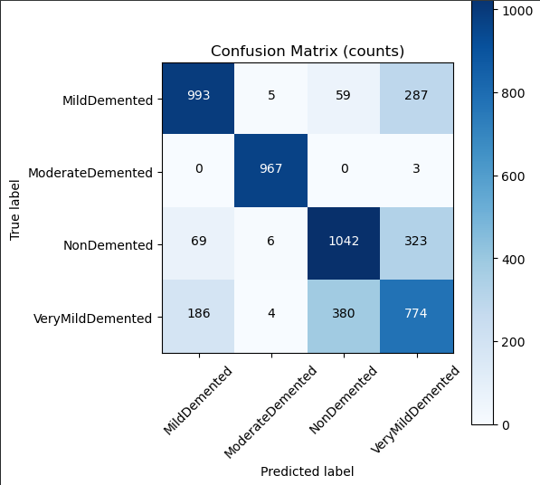
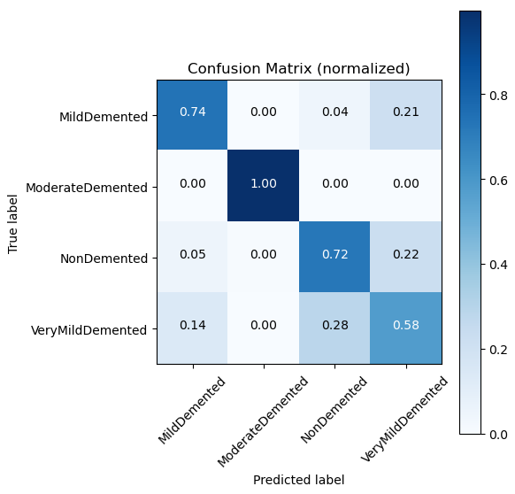
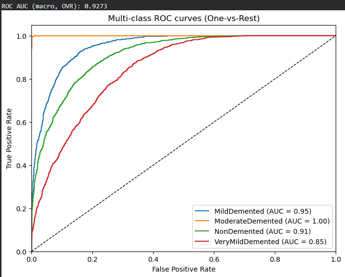

# 🧠 Alzheimer's Disease Detection Using Deep Learning

<p align="center">
  
</p>

<p align="center">
  <b>Multi-Class Brain MRI Classification using CNNs and ResNet50 Transfer Learning</b>
</p>

<p align="center">
  
  
  
  
  
  
</p>

---

## 📌 Project Overview

This project implements a deep learning–based system for **4-class Alzheimer's disease classification from brain MRI images**. Two approaches are developed and evaluated:

- **Baseline CNN** trained directly on the MRI dataset.
- **ResNet50 Transfer Learning** using ImageNet-pretrained weights with partial fine-tuning.

The pipeline includes image preprocessing, data augmentation, model training, validation, and multi-class performance evaluation using accuracy, precision, recall, F1-score, confusion matrix, classification report, and ROC-AUC.

---

## 🎯 Problem Statement

Alzheimer's disease is a progressive neurodegenerative condition associated with structural changes in the brain. Distinguishing different stages from MRI scans can be challenging because the visual differences between certain classes can be subtle.

The objective of this project is to investigate whether deep learning models can automatically learn discriminative spatial patterns from brain MRI images and classify them into four Alzheimer's-related categories.

### Classification Classes

| Class | Description |
|---|---|
| 🟢 **NonDemented** | MRI scans without dementia classification |
| 🟡 **VeryMildDemented** | Very mild dementia stage |
| 🟠 **MildDemented** | Mild dementia stage |
| 🔴 **ModerateDemented** | Moderate dementia stage |

---

## 📊 Dataset

The project performs multi-class classification of brain MRI images into four categories:

| Class | Description |
|---|---|
| `NonDemented` | Non-demented |
| `VeryMildDemented` | Very mild dementia |
| `MildDemented` | Mild dementia |
| `ModerateDemented` | Moderate dementia |

The model evaluation uses **5,098 test samples**.
---

## 📊 Dataset Visualization

The visualization step verifies that MRI images are loaded correctly and that the corresponding class labels are mapped properly before model training.

<p align="center">
  
</p>

The sample grid shows MRI scans from all four classes, providing a visual verification of the dataset labeling and image-loading pipeline.
---

# 🔬 Machine Learning Pipeline

The project follows an end-to-end medical image classification pipeline, starting from raw MRI images and progressing through dataset preparation, stratified partitioning, image preprocessing, model training, and comprehensive performance evaluation.

```text
                 Brain MRI Dataset
                        │
                        ▼
              Dataset Organization
                        │
                        ▼
              Pandas DataFrame
             ┌──────────┴──────────┐
             │                     │
             ▼                     ▼
      Image File Paths          Labels
             │                     │
             └──────────┬──────────┘
                        ▼
              Stratified Splitting
                        │
        ┌───────────────┼───────────────┐
        ▼               ▼               ▼
     Training       Validation         Test
     24,553           4,333           5,098
        │               │               │
        ▼               ▼               ▼
 Augmentation        Rescaling       Rescaling
        │               │               │
        └───────────────┴───────────────┘
                        ▼
                ImageDataGenerator
                        │
             ┌──────────┴──────────┐
             ▼                     ▼
       Baseline CNN          ResNet50 Transfer
                             Learning + Fine-Tuning
             │                     │
             └──────────┬──────────┘
                        ▼
                 Model Prediction
                        │
                        ▼
              Comprehensive Evaluation
                        │
        ┌───────────────┼────────────────┐
        ▼               ▼                ▼
    Classification   Confusion        ROC-AUC
      Metrics         Matrix           Curves
```
---


# ⚙️ Data Preparation

The MRI dataset was transformed into a structured **Pandas DataFrame** containing image file paths and their corresponding class labels. This tabular representation was then used to construct the training, validation, and test pipelines.

### 📊 Dataset Partition

A **stratified two-stage split** was implemented using `train_test_split()` with a fixed random seed to preserve class proportions across the datasets.

| Dataset | Images | Purpose |
|---|---:|---|
| **Training** | 24,553 | Model parameter learning |
| **Validation** | 4,333 | Hyperparameter tuning and generalization monitoring |
| **Testing** | 5,098 | Final evaluation on unseen data |
| **Total** | **33,984** | |

### 🔄 Data Partitioning Strategy

The test set remains completely isolated from model training and is used only for final evaluation on unseen data. Image preprocessing and augmentation are described in the dedicated preprocessing section below.
---

# 🧪 Image Preprocessing & Augmentation

The MRI images are processed through TensorFlow/Keras `ImageDataGenerator` pipelines before being supplied to the models. The preprocessing pipeline standardizes image dimensions, normalizes pixel intensities, and applies augmentation to the training data.

### 🖼️ Preprocessing Configuration

| Operation | Configuration |
|---|---|
| **Image Size** | `128 × 128` |
| **Batch Size** | `32` |
| **Pixel Rescaling** | `1./255` |
| **Class Mode** | `categorical` |
| **Data Loader** | `flow_from_dataframe()` |

### 🔄 Training Augmentation

The training generator applies the following transformations:

- **Rotation:** Up to `20°`
- **Zoom:** `0.2`
- **Horizontal Flip:** Enabled
- **Pixel Rescaling:** `1./255`

These transformations increase the diversity of training inputs while retaining the original class labels.

### 🧪 Validation & Test Processing

Validation and test images are **only rescaled using `1./255`** and are not augmented. This ensures that model evaluation is performed on consistently preprocessed images without introducing artificial transformations.

The test generator uses `shuffle=False` so that the generated predictions remain aligned with the original test-data ordering during evaluation.
---

# 🧠 Baseline CNN

A custom **Convolutional Neural Network (CNN)** was developed from scratch to establish a baseline for the Alzheimer's MRI classification task. The model learns hierarchical spatial features through successive convolution and pooling operations before performing four-class classification through fully connected layers.

### 🏗️ Architecture

```text
Input MRI
128 × 128 × 3
      │
      ▼
Conv2D
32 Filters • 3 × 3 Kernel • ReLU
      │
      ▼
MaxPooling2D
2 × 2 Pool
      │
      ▼
Conv2D
64 Filters • 3 × 3 Kernel • ReLU
      │
      ▼
MaxPooling2D
2 × 2 Pool
      │
      ▼
Flatten
      │
      ▼
Dense
128 Neurons • ReLU
      │
      ▼
Dense
4 Neurons • Softmax
      │
      ▼
Alzheimer's Class
```
---

# 🚀 ResNet50 Transfer Learning

To improve upon the baseline CNN, the project uses **ResNet50 with ImageNet-pretrained weights** for transfer learning. The pretrained convolutional backbone is adapted to the Alzheimer's MRI classification task through partial fine-tuning and a custom classification head.

### 🏗️ Architecture

```text
Input MRI
128 × 128 × 3
      │
      ▼
ResNet50
ImageNet-Pretrained Weights
      │
      ▼
Partial Fine-Tuning
Last 10 Layers Trainable
      │
      ▼
Flatten
      │
      ▼
Dense
256 Neurons • ReLU
      │
      ▼
Dropout
0.5
      │
      ▼
Dense
4 Neurons • Softmax
      │
      ▼
Alzheimer's Class
```
---
# ⚙️ Training Configuration

The baseline CNN and ResNet50 transfer-learning model use separate optimization configurations suited to their respective training strategies.

| Configuration | Baseline CNN | ResNet50 |
|---|---:|---:|
| **Input Shape** | `128 × 128 × 3` | `128 × 128 × 3` |
| **Optimizer** | Adam | Adam |
| **Learning Rate** | `0.001` | `0.0001` |
| **Loss Function** | Categorical Cross-Entropy | Categorical Cross-Entropy |
| **Output Activation** | Softmax | Softmax |
| **Number of Classes** | `4` | `4` |

### 🛡️ ResNet50 Training Controls

The ResNet50 training process uses two callbacks:

- **EarlyStopping:** `patience=5` with `restore_best_weights=True`.
- **ReduceLROnPlateau:** `factor=0.5` with `patience=3`.

The transfer-learning model is trained for up to **20 epochs**, with validation data used to monitor model performance during training.

#### ReduceLROnPlateau

`ReduceLROnPlateau` dynamically decreases the learning rate when validation performance reaches a plateau. This enables smaller optimization steps during later stages of training and helps the model continue refining its parameters.

### 🔄 Model Training Strategy

The **baseline CNN** is trained from scratch to establish a reference point, while the **ResNet50 model** starts from ImageNet-pretrained representations and performs partial fine-tuning on the MRI dataset.

The same validation pipeline is used to monitor generalization throughout training, while the held-out test set remains untouched until the final evaluation stage.

---

# 🧪 Model Evaluation

After training, the final ResNet50 model is evaluated exclusively on the **5,098-image held-out test set**. The evaluation pipeline generates class predictions and probability scores, which are then used to assess both overall performance and class-specific behavior.

### 📊 Evaluation Metrics

The model is evaluated using multiple complementary metrics:

| Metric | Purpose |
|---|---|
| **Accuracy** | Measures the overall proportion of correctly classified MRI images |
| **Precision** | Measures the correctness of positive predictions for each class |
| **Recall** | Measures how effectively samples from each class are identified |
| **F1-score** | Provides a balance between precision and recall |
| **Confusion Matrix** | Analyzes class-wise correct and incorrect predictions |
| **ROC-AUC** | Measures the model's ability to discriminate between classes across thresholds |

### 🔲 Confusion Matrix — Prediction Counts

The raw confusion matrix shows the number of test samples assigned to each predicted class compared with their actual class.

<p align="center">
  
</p>

### 🔲 Normalized Confusion Matrix

The normalized confusion matrix represents class-wise prediction proportions, making it easier to compare classification behavior across classes with different sample distributions.

<p align="center">
  
</p>

### 📈 Multi-Class ROC Analysis

A **One-vs-Rest (OvR)** strategy is used to generate ROC curves for the four Alzheimer's-related classes. The ROC-AUC metric evaluates how effectively the model separates each class from the remaining classes across different classification thresholds.

<p align="center">
  
</p>

This multi-level evaluation provides a more complete view of model behavior than relying on accuracy alone, particularly for identifying class-specific errors and differences in discriminative performance.
---

# 🏆 Results & Performance

The final ResNet50 transfer-learning model was evaluated on **5,098 unseen MRI images** from the held-out test set.

### 📊 Overall Performance

| Metric | Score |
|---|---:|
| **Test Accuracy** | **74.07%** |
| **Macro Precision** | **76.05%** |
| **Macro Recall** | **75.88%** |
| **Macro F1-score** | **75.93%** |
| **Macro ROC-AUC** | **0.9273** |

### 📋 Class-wise Performance

| Class | Precision | Recall | F1-score |
|---|---:|---:|---:|
| **MildDemented** | 0.80 | 0.74 | 0.77 |
| **ModerateDemented** | **0.98** | **1.00** | **0.99** |
| **NonDemented** | 0.70 | 0.72 | 0.71 |
| **VeryMildDemented** | 0.56 | 0.58 | 0.57 |

### 📈 Class-wise ROC-AUC

| Class | ROC-AUC |
|---|---:|
| **MildDemented** | **0.95** |
| **ModerateDemented** | **1.00** |
| **NonDemented** | **0.91** |
| **VeryMildDemented** | **0.85** |

### 🔍 Performance Insights

The model demonstrates strong class-separation capability with a **0.9273 macro ROC-AUC**. The **ModerateDemented** class achieves the strongest classification performance, while **VeryMildDemented** presents the greatest challenge, with comparatively lower precision, recall, F1-score, and ROC-AUC.

The difference in class-wise performance highlights the difficulty of distinguishing subtle patterns associated with the very mild stage and motivates further investigation into class-aware training strategies and more advanced architectures.
---

# 🛠️ Tech Stack

| Category | Technologies |
|---|---|
| **Language** | Python |
| **Deep Learning** | TensorFlow |
| **Models** | CNN, ResNet50, Transfer Learning |
| **Data Processing** | NumPy, Pandas |
| **Machine Learning / Evaluation** | Scikit-learn |
| **Visualization** | Matplotlib, Seaborn |
| **Development Environment** | Jupyter Notebook |

### Core Techniques

```text
Computer Vision
      │
      ├── Image Preprocessing
      ├── Data Augmentation
      ├── CNN Feature Extraction
      ├── Transfer Learning
      ├── Partial Fine-Tuning
      ├── Dropout Regularization
      ├── Learning-Rate Scheduling
      └── Multi-Class Classification
```
