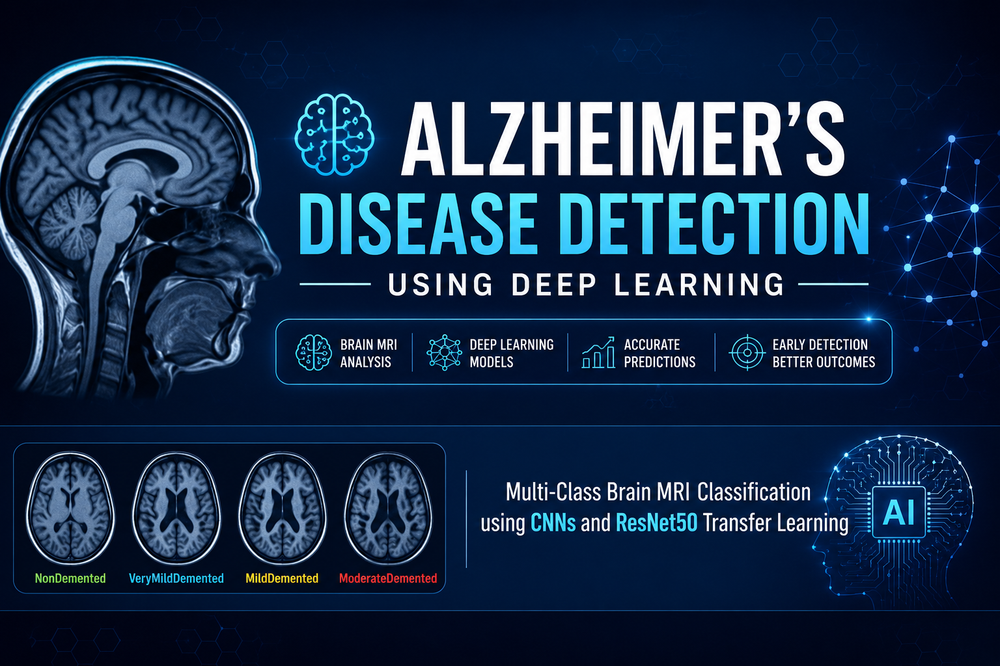
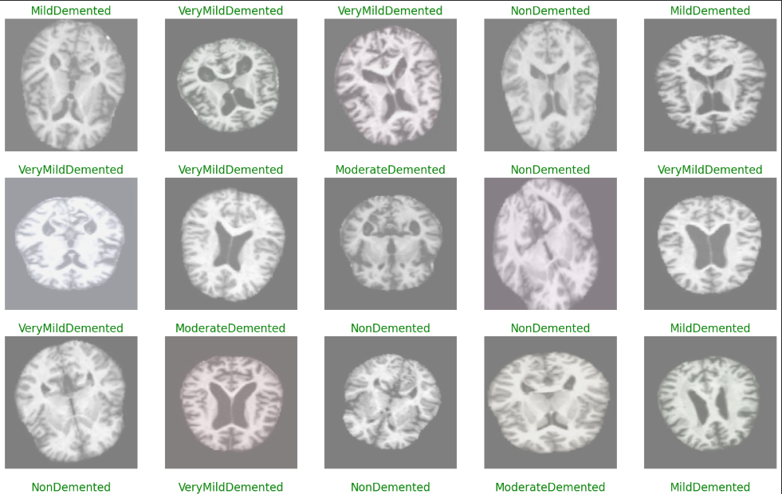

# 🧠 Alzheimer's Disease Detection Using Deep Learning

<p align="center">
  
</p>

<p align="center">
  <b>Multi-Class Brain MRI Classification using CNNs and ResNet50 Transfer Learning</b>
</p>

<p align="center">
  
  
  
  
  
  
</p>

---

## 📌 Project Overview

This project develops a deep learning-based system for **multi-class classification of Alzheimer's-related dementia stages from brain MRI images**.

The project implements and compares two approaches:

1. **Baseline Convolutional Neural Network (CNN)** built from scratch.
2. **ResNet50 Transfer Learning** using ImageNet-pretrained weights with partial fine-tuning and a custom classification head.

The complete workflow covers dataset organization, stratified data splitting, image preprocessing, augmentation, generator-based training, transfer learning, model optimization, and comprehensive evaluation using class-wise and multi-class performance metrics.

> **Note:** This project is intended as a machine learning research/educational system and should not be considered a clinically validated diagnostic tool.

---

## 🎯 Problem Statement

Alzheimer's disease is a progressive neurodegenerative condition associated with structural changes in the brain. Distinguishing different stages from MRI scans can be challenging because the visual differences between certain classes can be subtle.

The objective of this project is to investigate whether deep learning models can automatically learn discriminative spatial patterns from brain MRI images and classify them into four Alzheimer's-related categories.

### Classification Classes

| Class | Description |
|---|---|
| 🟢 **NonDemented** | MRI scans without dementia classification |
| 🟡 **VeryMildDemented** | Very mild dementia stage |
| 🟠 **MildDemented** | Mild dementia stage |
| 🔴 **ModerateDemented** | Moderate dementia stage |

---

# 🗂️ Dataset

The dataset consists of **33,984 brain MRI images** distributed across four classes.

### Class Distribution

| Class | Images |
|---|---:|
| NonDemented | 9,600 |
| MildDemented | 8,960 |
| VeryMildDemented | 8,960 |
| ModerateDemented | 6,464 |
| **Total** | **33,984** |

The images are organized into class-specific directories and converted into a structured Pandas DataFrame containing image file paths and corresponding class labels.

---

## 📊 Dataset Visualization

<p align="center">
  
</p>

The visualization step verifies that MRI images are loaded correctly and that the corresponding class labels are mapped properly before model training.

---

# 🔬 Machine Learning Pipeline

```text
                 Brain MRI Dataset
                        │
                        ▼
              Dataset Organization
                        │
                        ▼
              Pandas DataFrame
             ┌──────────┴──────────┐
             │                     │
             ▼                     ▼
      Image File Paths          Labels
             │                     │
             └──────────┬──────────┘
                        ▼
              Stratified Splitting
                        │
        ┌───────────────┼───────────────┐
        ▼               ▼               ▼
     Training       Validation         Test
        │               │               │
        ▼               ▼               ▼
 Image Augmentation   Rescaling       Rescaling
        │
        ▼
 ImageDataGenerator
        │
        ▼
 ┌──────────────────────────────┐
 │                              │
 ▼                              ▼
Baseline CNN             ResNet50 Transfer
                         Learning + Fine-Tuning
 │                              │
 └──────────────┬───────────────┘
                ▼
          Model Evaluation
                │
                ▼
 Accuracy • Precision • Recall
 F1-score • Confusion Matrix
 ROC-AUC • ROC Curves
